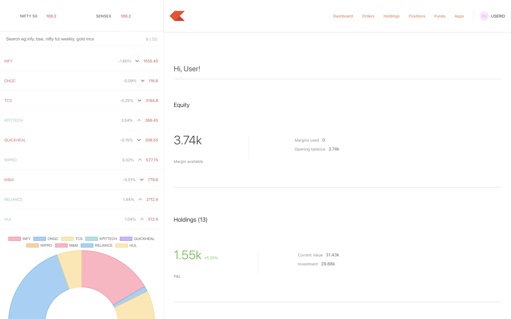
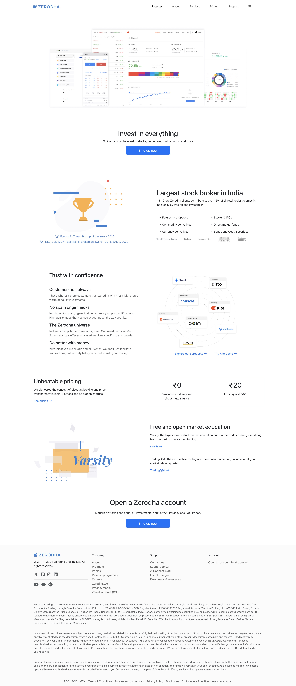

# Zerodha Clone

This is a clone of the popular stock trading platform Zerodha built using the MERN stack. The project replicates key features including real-time stock updates, user authentication, and portfolio management.

## Features

- **Full Frontend Clone:** The project includes a complete frontend clone of Zerodha.
- **Dashboard:** The dashboard displays holdings and positions data.
- **User Authentication:** Users can register and log in securely.
- **Orders Page:** Shows stock transactions for the logged-in user.
- **Real-time Updates:** Real-time stock updates for an immersive experience.

## Technologies Used

### Frontend

- **React:** For building the user interface.
- **Bootstrap:** For responsive and stylish design.
- **React Router DOM:** For client-side routing.
- **Material UI:** For advanced UI components in the dashboard.
- **Charts.js:** For data visualization in the dashboard.
- **Axios:** For making HTTP requests to the backend.

### Backend

- **Node.js:** For server-side JavaScript.
- **Express.js:** For building the RESTful API.
- **MongoDB:** As the database.
- **Mongoose:** For object data modeling (ODM) with MongoDB.
- **Bcrypt:** For hashing passwords.
- **JWT:** For secure user authentication.

## Screenshots


_Mockup_


_Dashboard_


_Home Page_

## Installation

1. **Clone the repository:**

   ```bash
   git clone https://github.com/yourusername/zerodha-clone.git
   cd zerodha-clone
   ```

2. **Install dependencies:**

   - Install backend dependencies:

     ```bash
     cd backend
     npm install
     ```

   - Install frontend dependencies:
     ```bash
     cd ../frontend
     npm install
     ```

3. **Configure environment variables:**

   Create a `.env` file in the `backend` directory and add your MongoDB connection string, JWT secret, and other necessary environment variables.

   ```env
   PORT=3002
   MONGO_URL=your_mongodb_connection_string
   SECRET=your_jwt_secret
   ```

4. **Run the application:**

   - Start the backend server:

     ```bash
     cd backend
     npm start
     ```

   - Start the frontend development server:
     ```bash
     cd ../frontend
     npm start
     ```

## Usage

1. Open your browser and navigate to `http://localhost:3000` to see the frontend.
2. Register a new user or log in with existing credentials.
3. Explore the dashboard to view holdings and positions data.
4. Check the orders page to see stock transactions of the logged-in user.

## Live Demo

Check out the live demo of the project [here](https://zerodha-clone-frontend.vercel.app).

1. Username : Demo
2. Password : Demo

## Version Releases

Track the version releases and updates on our Notion page [here](https://jenil-desai.notion.site/Version-Releases-Zerodha-Clone-5bdae32caa7947b8b4e2fb0cb50fb50e?pvs=4).

## Contributing

Feel free to submit issues or pull requests. Contributions are welcome!

## License

This project is licensed under the MIT License. See the [LICENSE](LICENSE) file for details.
